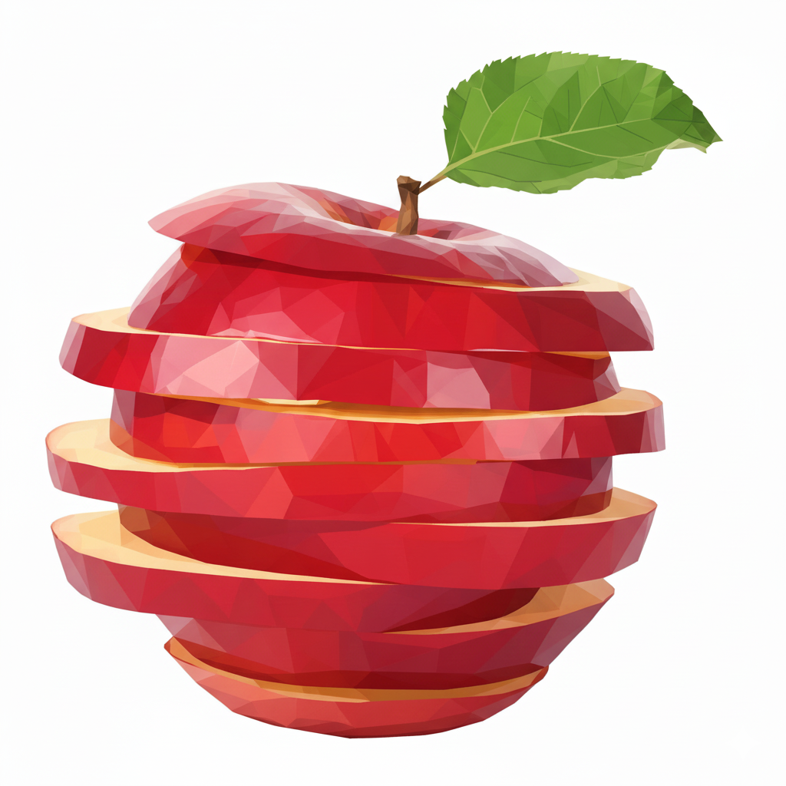

<p align="center">
    
</p>

<p align="center">
  <a href="https://github.com/jgphilpott/polyslice/actions"></a>
  <a href="https://badge.fury.io/js/@jgphilpott%2Fpolyslice"></a>
  <a href="https://opensource.org/licenses/MIT"></a>
</p>

# Polyslice

An [FDM](https://en.wikipedia.org/wiki/Fused_filament_fabrication) [slicer](https://en.wikipedia.org/wiki/Slicer_(3D_printing)) designed specifically for [three.js](https://github.com/mrdoob/three.js) and inspired by the discussion on [this three.js issue](https://github.com/mrdoob/three.js/issues/17981). The idea is to be able to go straight from a mesh in a three.js scene to a machine usable [G-code](https://en.wikipedia.org/wiki/G-code), thus eliminating the need for intermediary file formats and 3rd party slicing software.

## Installation

### Node.js

```bash
npm install @jgphilpott/polyslice
```

### Browser

```html
<!-- Include three.js first -->
<script src="https://unpkg.com/three@0.180.0/build/three.min.js"></script>

<!-- Include Polyslice -->
<script src="https://unpkg.com/@jgphilpott/polyslice/dist/index.browser.min.js"></script>
```

## Quick Start

### Node.js

```javascript
const Polyslice = require('@jgphilpott/polyslice');

// Create a slicer instance.
const slicer = new Polyslice({
  nozzleTemperature: 200,
  bedTemperature: 60,
  fanSpeed: 100
});

// Generate some G-code.
const gcode = slicer.codeAutohome() +
              slicer.codeNozzleTemperature(200, false) +
              slicer.codeLinearMovement(10, 10, 0.2, 0.1, 1500);

console.log(gcode);
```

### Browser

```javascript
// Polyslice is available as a global variable.
const slicer = new Polyslice({
  nozzleTemperature: 200,
  bedTemperature: 60,
  fanSpeed: 100
});

// Generate some G-code.
const gcode = slicer.codeAutohome() +
              slicer.codeNozzleTemperature(200, false) +
              slicer.codeLinearMovement(10, 10, 0.2, 0.1, 1500);

console.log(gcode);
```

## Features

- 🚀 **Direct three.js integration** - Work directly with three.js meshes and scenes.
- 📁 **File format support** - Built-in loaders for STL, OBJ, 3MF, AMF, PLY, GLTF/GLB, and Collada formats.
- 📝 **Comprehensive G-code generation** - Full set of G-code commands for FDM printing.
- ⚙️ **Configurable parameters** - Temperatures, speeds, units, and more.
- 🌐 **Universal compatibility** - Works in both Node.js and browser environments.
- 🧪 **Well tested** - Comprehensive test suite with Jest.
- 📦 **Multiple formats** - CommonJS, ESM, and browser builds with minification.
- 🔧 **CoffeeScript source** - Clean, readable CoffeeScript codebase.

## About

Polyslice is designed to streamline the 3D printing workflow by integrating directly with three.js. Whether you're designing models in three.js or loading existing STL, OBJ, or other 3D files, Polyslice can process them and generate G-code without the need for separate slicing software like [Cura](https://github.com/Ultimaker/Cura).

With built-in support for popular 3D file formats and the ability to send G-code directly to your 3D printer via [Web Serial API](https://developer.mozilla.org/en-US/docs/Web/API/Web_Serial_API), the entire design-to-print workflow can happen seamlessly in a web browser or Node.js environment. This makes 3D printing more accessible and eliminates the friction of using multiple tools.

## API Documentation

### Constructor

```javascript
const slicer = new Polyslice(options);
```

**Options:**

- `autohome` (boolean): Auto-home before slicing (default: true).
- `workspacePlane` (string): XY, XZ, or YZ (default: 'XY').
- `timeUnit` (string): 'milliseconds' or 'seconds' (default: 'milliseconds').
- `lengthUnit` (string): 'millimeters' or 'inches' (default: 'millimeters').
- `temperatureUnit` (string): 'celsius', 'fahrenheit', or 'kelvin' (default: 'celsius').
- `nozzleTemperature` (number): Nozzle temperature (default: 0).
- `bedTemperature` (number): Bed temperature (default: 0).
- `fanSpeed` (number): Fan speed percentage 0-100 (default: 100).
- `exposureDetection` (boolean): Enable adaptive skin layer generation for exposed surfaces (default: true).
- `exposureDetectionResolution` (number): Sample count for exposure detection analysis, higher = more accurate but slower (default: 900 for 30×30 grid).
- `printer` (Printer): Printer instance for automatic configuration (default: null).
- `filament` (Filament): Filament instance for automatic configuration (default: null).

**Using Printer and Filament for Automatic Configuration:**

When you provide `printer` and/or `filament` instances, the slicer automatically configures itself with optimal settings:

```javascript
const { Polyslice, Printer, Filament } = require('@jgphilpott/polyslice');

// Automatic configuration from printer and filament
const slicer = new Polyslice({
  printer: new Printer('Ender3'),
  filament: new Filament('GenericPLA')
});
// Automatically sets: build plate size, nozzle diameter, temperatures, retraction, etc.
```

**Configuration Priority:**

Settings are applied in this order (highest priority first):
1. Custom options you provide
2. Filament settings
3. Printer settings
4. Default values

```javascript
// Custom bedTemperature overrides filament setting
const slicer = new Polyslice({
  printer: new Printer('Ender3'),
  filament: new Filament('GenericPLA'),
  bedTemperature: 0  // Overrides filament's 60°C bed temperature
});
```

### Printer Configuration

The `Printer` class provides pre-configured settings for popular 3D printers, simplifying the setup process.

```javascript
const { Printer } = require('@jgphilpott/polyslice');

// Create a printer instance.
const printer = new Printer('Ender3');

// Get printer specifications.
console.log(printer.getSize());        // { x: 220, y: 220, z: 250 }
console.log(printer.getNozzle(0));     // { filament: 1.75, diameter: 0.4, gantry: 25 }
console.log(printer.getHeatedBed());   // true

// Modify printer settings.
printer.setSizeX(250);
printer.setNozzle(0, 1.75, 0.6, 30);

// List all available printers.
console.log(printer.listAvailablePrinters());
```

**Available Printers (44 total):**

- **Creality Ender series**: `Ender3`, `Ender3V2`, `Ender3Pro`, `Ender3S1`, `Ender5`, `Ender6`
- **Creality large format**: `CR10`, `CR10S5`, `CR6SE`
- **Creality high-speed**: `CrealityK1`, `CrealityK1Max` (enclosed)
- **Prusa Research**: `PrusaI3MK3S`, `PrusaMini`, `PrusaXL`, `PrusaMK4`
- **Bambu Lab**: `BambuLabX1Carbon`, `BambuLabP1P`, `BambuLabA1`, `BambuLabA1Mini`
- **Anycubic**: `AnycubicI3Mega`, `AnycubicKobra`, `AnycubicVyper`, `AnycubicPhotonMonoX`
- **Elegoo Neptune**: `ElegooNeptune3`, `ElegooNeptune3Pro`, `ElegooNeptune4`, `ElegooNeptune4Pro`
- **Artillery**: `ArtillerySidewinderX1`, `ArtillerySidewinderX2`, `ArtilleryGenius`
- **Sovol**: `SovolSV06`, `SovolSV06Plus`
- **Others**: `Voron24`, `UltimakerS5`, `FlashForgeCreatorPro`, `FlashforgeAdventurer3`, `Raise3DPro2`, `MakerbotReplicatorPlus`, `QidiXPlus`, `MonopriceSelectMiniV2`, `LulzBotMini2`, `LulzBotTAZ6`, `KingroonKP3S`, `AnkerMakeM5`

**Printer Properties:**

- `size` (object): Build volume dimensions `{ x, y, z }` in millimeters
- `shape` (string): Build plate shape - 'rectangular' or 'circular'
- `centred` (boolean): Whether origin is at center or corner
- `heated` (object): Heating capabilities `{ volume, bed }`
- `nozzles` (array): Array of nozzle configurations with `filament`, `diameter`, and `gantry` properties

### Filament Configuration

The `Filament` class provides pre-configured settings for popular 3D printing filaments, including temperature, retraction, and material properties.

```javascript
const { Filament } = require('@jgphilpott/polyslice');

// Create a filament instance.
const filament = new Filament('GenericPLA');

// Get filament properties.
console.log(filament.getType());              // 'pla'
console.log(filament.getNozzleTemperature()); // 200
console.log(filament.getBedTemperature());    // 60
console.log(filament.getFan());               // 100
console.log(filament.getRetractionDistance());// 5

// Modify filament settings.
filament.setNozzleTemperature(210);
filament.setFan(80);

// List all available filaments.
console.log(filament.listAvailableFilaments());
```

**Available Filaments (35 total):**

- **Generic Materials**: `GenericPLA`, `GenericPETG`, `GenericABS`, `GenericTPU`, `GenericNylon`, `GenericASA`
- **PLA Brands**: `HatchboxPLA`, `eSunPLAPlus`, `OverturePLA`, `PrusamentPLA`, `PolymakerPolyLitePLA`, `PolymakerPolyTerraPLA`, `PolymakerPolyMaxPLA`, `BambuLabPLABasic`, `BambuLabPLAMatte`, `SunluPLA`, `ColorFabbPLAPHA`
- **PETG Brands**: `PrusamentPETG`, `PrusaPETG`, `BambuLabPETGHF`, `PolymakerPolyLitePETG`, `eSunPETG`, `OverturePETG`, `HatchboxPETG`, `SunluPETG`, `ColorFabbNGen`
- **ABS Brands**: `BambuLabABS`, `eSunABSPlus`, `HatchboxABS`
- **Flexible (TPU)**: `NinjaFlexTPU`, `SainSmartTPU`, `PolymakerPolyFlexTPU95`
- **Engineering**: `3DXTechCarbonX` (carbon fiber nylon)
- **2.85mm Diameter**: `UltimakerPLA`, `UltimakerToughPLA`

**Filament Properties:**

- `type` (string): Material type - 'pla', 'petg', 'abs', 'tpu', 'nylon', etc.
- `name` (string): Full product name
- `brand` (string): Manufacturer/brand name
- `diameter` (number): Filament diameter in mm (1.75 or 2.85)
- `density` (number): Material density in g/cm³
- `temperature` (object): Temperatures `{ bed, nozzle, standby }` in Celsius
- `retraction` (object): Retraction settings `{ speed, distance }`
- `fan` (number): Recommended fan speed percentage (0-100)
- `color` (string): Hex color code
- `weight` (number): Spool weight in grams
- `cost` (number): Cost per spool

### Advanced Slicing Features

#### Exposure Detection

Polyslice includes an adaptive skin layer generation algorithm that can intelligently detect exposed surfaces on your model and apply skin layers only where needed. This feature is enabled by default for optimized prints.

**What it does:**
- Analyzes each layer to detect exposed surfaces (top and bottom surfaces within the skin layer range)
- Automatically generates skin layers only on exposed regions instead of solid layers
- Reduces print time and material usage while maintaining surface quality
- Uses coverage sampling to determine which areas need skin reinforcement

**When to use it:**
- Complex geometries with varying surface exposure throughout the print
- Models with overhangs, bridges, or varying cross-sections
- When you want to optimize material usage without compromising surface quality

**When to disable it:**
- Simple geometries (cubes, cylinders) where standard top/bottom skin layers are sufficient
- Models with smooth, gradually changing surfaces where the algorithm may detect false positives
- When print time is not a concern and you prefer consistent solid top/bottom layers

**Example:**

```javascript
const slicer = new Polyslice({
  nozzleTemperature: 210,
  bedTemperature: 60,
  exposureDetection: true,  // Enabled by default
  exposureDetectionResolution: 900  // 30×30 grid (default), higher = more accurate
});

// Adjust resolution at runtime for finer detail
slicer.setExposureDetectionResolution(1600);  // 40×40 grid for very fine details

// Or disable exposure detection if needed
slicer.setExposureDetection(false);
```

**Technical details:**
- Uses marching squares algorithm to trace smooth contours of exposed regions
- Default resolution: 900 samples (30×30 grid) - balances accuracy and performance
- Higher resolutions (1600 = 40×40, 2500 = 50×50) provide more detail but are slower
- Lower resolutions (400 = 20×20) are faster but may miss fine geometric changes
- Checks the layer exactly skinLayerCount steps ahead/behind for each layer independently
- Generates adaptive skin patches that grow/shrink naturally with geometry changes

### File Loader

The `Loader` module provides a unified interface for loading 3D models from various file formats.

```javascript
const { Loader } = require('@jgphilpott/polyslice');

// Initialize loaders (automatically called on first use)
Loaders.initialize();
```

**Supported Formats:**

| Format | Method | Description |
|--------|--------|-------------|
| STL | `Loader.loadSTL(path, material?)` | Stereolithography format |
| OBJ | `Loader.loadOBJ(path, material?)` | Wavefront Object format |
| 3MF | `Loader.load3MF(path)` | 3D Manufacturing Format |
| AMF | `Loader.loadAMF(path)` | Additive Manufacturing File |
| PLY | `Loader.loadPLY(path, material?)` | Polygon File Format |
| GLTF/GLB | `Loader.loadGLTF(path)` | GL Transmission Format |
| Collada | `Loader.loadCollada(path)` | DAE format |
| Auto-detect | `Loader.load(path, options?)` | Detects format from extension |

**Return Values:**
- All loader methods return `Promise<Mesh>` or `Promise<Mesh[]>`
- STL and PLY return a single `THREE.Mesh`
- OBJ, 3MF, AMF, GLTF, and Collada may return multiple meshes if the file contains multiple objects
- Single mesh is returned as-is, multiple meshes are returned as an array

**Material Parameter:**
- Optional `THREE.Material` for STL, OBJ, and PLY loaders
- If not provided, a default `MeshPhongMaterial` is used
- 3MF, AMF, GLTF, and Collada use materials defined in the file

**Example:**

```javascript
// Load STL with default material
const mesh = await Loader.loadSTL('model.stl');

// Load OBJ with custom material
const THREE = require('three');
const material = new THREE.MeshPhongMaterial({ color: 0xff0000 });
const meshes = await Loader.loadOBJ('model.obj', material);

// Auto-detect format
const model = await Loader.load('model.gltf');
```

### G-code Exporter

The `Exporter` module provides functionality to save G-code to files and stream it to 3D printers via serial port.

```javascript
const { Exporter } = require('@jgphilpott/polyslice');
```

**File Saving:**

```javascript
// Save G-code to file (Node.js: saves to filesystem, Browser: triggers download)
await Exporter.saveToFile(gcode, 'output.gcode');
```

**Serial Port Communication:**

```javascript
// Connect to 3D printer
await Exporter.connectSerial({
    path: '/dev/ttyUSB0',  // Node.js only (or COM3 on Windows)
    baudRate: 115200       // Both environments
});

// Send single command
await Exporter.sendLine('G28');

// Stream G-code with progress tracking
await Exporter.streamGCode(gcode, {
    delay: 100,  // milliseconds between lines
    onProgress: (current, total, line) => {
        console.log(`${current}/${total}: ${line}`);
    }
});

// Disconnect
await Exporter.disconnectSerial();
```

**Available Methods:**

| Method | Description |
|--------|-------------|
| `saveToFile(gcode, filename)` | Save G-code to file |
| `connectSerial(options)` | Connect to serial port |
| `disconnectSerial()` | Disconnect from serial port |
| `sendLine(line)` | Send single G-code line |
| `streamGCode(gcode, options)` | Stream G-code line-by-line |
| `readResponse(timeout)` | Read response from printer |

**Environment Support:**
- **Node.js**: Requires `serialport` package (`npm install serialport`)
- **Browser**: Uses Web Serial API (Chrome 89+, Edge 89+)

### G-code Generation Methods

```javascript
// Basic Setup
slicer.codeAutohome()                    // G28 - Auto-home all axes.
slicer.codeWorkspacePlane('XY')          // G17/G18/G19 - Set workspace plane.
slicer.codeLengthUnit('millimeters')     // G20/G21 - Set units.

// Temperature Control
slicer.codeNozzleTemperature(200, true)  // M109/M104 - Set nozzle temp.
slicer.codeBedTemperature(60, true)      // M190/M140 - Set bed temp.
slicer.codeFanSpeed(100)                 // M106/M107 - Control fan.

// Movement
slicer.codeLinearMovement(x, y, z, e, f) // G0/G1 - Linear movement.
slicer.codeArcMovement(...)              // G2/G3 - Arc movement.
slicer.codeBézierMovement([...])         // G5 - Bézier curves.

// Utilities
slicer.codeMessage('Hello World!')       // M117 - Display message.
slicer.codeDwell(1000)                   // G4/M0 - Pause/dwell.
slicer.codeWait()                        // M400 - Wait for moves to finish.
```

## Examples

### Basic Usage

```javascript
const Polyslice = require('@jgphilpott/polyslice');

const slicer = new Polyslice({
  nozzleTemperature: 210,
  bedTemperature: 60,
  fanSpeed: 80
});

// Print a simple square.
let gcode = '';
gcode += slicer.codeAutohome();
gcode += slicer.codeNozzleTemperature(210, true);
gcode += slicer.codeBedTemperature(60, true);

// Draw square perimeter.
gcode += slicer.codeLinearMovement(0, 0, 0.2, null, 3000);  // Move to start.
gcode += slicer.codeLinearMovement(10, 0, 0.2, 0.5, 1200);  // Bottom edge.
gcode += slicer.codeLinearMovement(10, 10, 0.2, 0.5, 1200); // Right edge.
gcode += slicer.codeLinearMovement(0, 10, 0.2, 0.5, 1200);  // Top edge.
gcode += slicer.codeLinearMovement(0, 0, 0.2, 0.5, 1200);   // Left edge.

gcode += slicer.codeAutohome();

console.log(gcode);
```

### Using Printer Configurations

```javascript
const { Polyslice, Printer } = require('@jgphilpott/polyslice');

// Create a printer instance with your printer model.
const printer = new Printer('Ender3');

// Access printer specifications.
console.log(`Build volume: ${printer.getSizeX()} x ${printer.getSizeY()} x ${printer.getSizeZ()} mm`);
console.log(`Nozzle diameter: ${printer.getNozzle(0).diameter} mm`);
console.log(`Filament diameter: ${printer.getNozzle(0).filament} mm`);

// Customize printer settings if needed.
printer.setSizeZ(300);  // Modify build height.

// Create a slicer instance with automatic printer configuration.
const slicer = new Polyslice({
  printer: printer,
  nozzleTemperature: 210,
  bedTemperature: 60
});

// Or update printer at runtime
slicer.setPrinter(new Printer('CR10'));  // Automatically updates build plate dimensions

console.log('Slicer configured for:', slicer.getPrinter().getModel());
```

### Using Printer and Filament Configurations

```javascript
const { Polyslice, Printer, Filament } = require('@jgphilpott/polyslice');

// Create printer and filament instances.
const printer = new Printer('Ender3');
const filament = new Filament('PrusamentPLA');

// Automatic configuration - just pass printer and filament!
const slicer = new Polyslice({
  printer: printer,
  filament: filament
});

// All settings automatically configured:
console.log('Build plate:', slicer.getBuildPlateWidth(), 'x', slicer.getBuildPlateLength(), 'mm');
console.log('Nozzle temp:', slicer.getNozzleTemperature() + '°C');
console.log('Bed temp:', slicer.getBedTemperature() + '°C');
console.log('Nozzle diameter:', slicer.getNozzleDiameter(), 'mm');
console.log('Filament diameter:', slicer.getFilamentDiameter(), 'mm');
console.log('Retraction:', slicer.getRetractionDistance(), 'mm');

// Override specific settings if needed
const customSlicer = new Polyslice({
  printer: new Printer('Ender3'),
  filament: new Filament('GenericPLA'),
  bedTemperature: 0,  // Override for broken bed heater
  nozzleTemperature: 210  // Override for personal preference
});

// Update printer/filament at runtime
slicer.setPrinter(new Printer('CR10'));  // Updates build volume
slicer.setFilament(new Filament('GenericPETG'));  // Updates temperatures

console.log('Slicer ready with optimized settings!');
```

### Three.js Integration

```javascript
const THREE = require('three');
const Polyslice = require('@jgphilpott/polyslice');

// Create three.js scene.
const scene = new THREE.Scene();
const geometry = new THREE.BoxGeometry(20, 20, 5);
const material = new THREE.MeshBasicMaterial({ color: 0x00ff00 });
const cube = new THREE.Mesh(geometry, material);
scene.add(cube);

// Create slicer and generate G-code.
const slicer = new Polyslice({
  nozzleTemperature: 210,
  bedTemperature: 60
});

// Basic slicing (simplified).
const layerHeight = 0.2;
const numLayers = Math.ceil(5 / layerHeight);
let gcode = slicer.slice();

// Add layer-by-layer printing logic here ...
```

### File Loading

Polyslice includes built-in support for loading 3D models from various file formats commonly used in 3D printing and modeling.

#### Supported Formats

- **STL** (Stereolithography) - Most common 3D printing format
- **OBJ** (Wavefront Object) - Common 3D modeling format
- **3MF** (3D Manufacturing Format) - Modern 3D printing format with color/material support
- **AMF** (Additive Manufacturing File) - XML-based additive manufacturing format
- **PLY** (Polygon File Format) - Often used for 3D scanning
- **GLTF/GLB** (GL Transmission Format) - Modern 3D asset format with materials
- **DAE** (Collada) - Common 3D asset exchange format

#### Basic File Loading

```javascript
const { Loader } = require('@jgphilpott/polyslice');

// Load an STL file
const mesh = await Loader.loadSTL('model.stl');

// Load an OBJ file (may return multiple meshes)
const meshes = await Loader.loadOBJ('model.obj');

// Load a 3MF file
const meshes = await Loader.load3MF('model.3mf');

// Load a GLTF file
const meshes = await Loader.loadGLTF('model.gltf');

// Generic loader (auto-detects format from extension)
const mesh = await Loader.load('model.stl');
```

#### Custom Materials

```javascript
const THREE = require('three');
const { Loader } = require('@jgphilpott/polyslice');

// Create a custom material
const material = new THREE.MeshPhongMaterial({
  color: 0xff0000,
  specular: 0x111111,
  shininess: 200
});

// Load with custom material
const mesh = await Loader.loadSTL('model.stl', material);
```

#### Complete Workflow

```javascript
const Polyslice = require('@jgphilpott/polyslice');
const { Loaders, Printer, Filament } = require('@jgphilpott/polyslice');

// Load a 3D model from file
const mesh = await Loader.loadSTL('model.stl');

// Create a slicer instance with printer and filament
const slicer = new Polyslice({
  printer: new Printer('Ender3'),
  filament: new Filament('PrusamentPLA')
});

// Generate G-code from the loaded mesh
// (Note: Full slicing implementation coming soon)
const gcode = slicer.slice(mesh);
```

#### Browser Usage

```html
<!DOCTYPE html>
<html>
  <head>
    <title>Polyslice File Loading Example</title>

    <!-- Include three.js -->
    <script src="https://unpkg.com/three@0.180.0/build/three.min.js"></script>

    <!-- Include three.js loaders you need -->
    <script type="module">
      import { STLLoader } from 'https://unpkg.com/three@0.180.0/examples/jsm/loaders/STLLoader.js';
      import { OBJLoader } from 'https://unpkg.com/three@0.180.0/examples/jsm/loaders/OBJLoader.js';

      // Make loaders available globally
      window.THREE.STLLoader = STLLoader;
      window.THREE.OBJLoader = OBJLoader;
    </script>

    <!-- Include Polyslice -->
    <script src="https://unpkg.com/@jgphilpott/polyslice/dist/index.browser.min.js"></script>
  </head>
  <body>
    <input type="file" id="fileInput" accept=".stl,.obj,.gltf,.glb">

    <script>
      document.getElementById('fileInput').addEventListener('change', async (e) => {
        const file = e.target.files[0];
        const url = URL.createObjectURL(file);

        // Load the file
        const mesh = await PolysliceLoader.load(url);

        console.log('Loaded mesh:', mesh);

        // Clean up
        URL.revokeObjectURL(url);
      });
    </script>
  </body>
</html>
```

**Note:** In Node.js, loaders use dynamic `import()` for ES modules. In browsers, three.js loaders must be included separately as shown above.

### Browser Integration

```html
<!DOCTYPE html>
<html>
    <head>
        <title>Polyslice Browser Example</title>
        <script src="https://unpkg.com/three@0.180.0/build/three.min.js"></script>
        <script src="https://unpkg.com/polyslice/dist/index.browser.min.js"></script>
    </head>
    <body>
        <script>

            // Create three.js scene.
            const scene = new THREE.Scene();
            const geometry = new THREE.BoxGeometry(20, 20, 5);
            const material = new THREE.MeshBasicMaterial({ color: 0x00ff00 });
            const cube = new THREE.Mesh(geometry, material);
            scene.add(cube);

            // Create slicer instance.
            const slicer = new Polyslice({
                nozzleTemperature: 210,
                bedTemperature: 60,
                fanSpeed: 100
            });

            // Generate G-code.
            let gcode = '';
            gcode += slicer.codeAutohome();
            gcode += slicer.codeNozzleTemperature(210, true);
            gcode += slicer.codeBedTemperature(60, true);

            // Simple square print.
            gcode += slicer.codeLinearMovement(0, 0, 0.2, null, 3000);
            gcode += slicer.codeLinearMovement(20, 0, 0.2, 1, 1200);
            gcode += slicer.codeLinearMovement(20, 20, 0.2, 1, 1200);
            gcode += slicer.codeLinearMovement(0, 20, 0.2, 1, 1200);
            gcode += slicer.codeLinearMovement(0, 0, 0.2, 1, 1200);

            console.log('Generated G-code:', gcode);

        </script>
    </body>
</html>
```

## Development

### Prerequisites

This repository uses [Git LFS](https://git-lfs.github.com/) to store G-code sample files. Make sure you have Git LFS installed:

```bash
# Install Git LFS
git lfs install

# If you cloned before installing LFS, pull the actual files:
git lfs pull
```

### Development Commands

```bash
# Install Dependencies
npm install

# Run Tests
npm test

# Build for Production
npm run build

# Run Examples
node examples/basic.js
node examples/threejs-integration.js
```

## Testing

The project includes comprehensive tests using Jest:

```bash
npm test              # Run all tests.
npm run test:watch    # Run tests in watch mode.
npm run test:coverage # Run tests with coverage.
```

## Building

Multiple build targets are supported:

```bash
npm run build:node    # Node.js builds (CommonJS + ESM).
npm run build:browser # Browser build (IIFE).
npm run build:cjs     # CommonJS build only.
npm run build:esm     # ES modules build only.
npm run build:minify  # Minified builds.
npm run build         # All builds.
```

## Tools

### G-code Visualizer

A browser-based tool to visualize G-code files in 3D using Three.js. This tool helps with debugging and testing G-code generated by Polyslice (or any other slicer).

**[Open G-code Visualizer](https://jgphilpott.github.io/polyslice/examples/visualizer/visualizer.html)**

Features:
- 📊 **3D Visualization** - View G-code tool paths in interactive 3D
- 🎨 **Color-coded movements** - Different colors for travel (G0), extrusion (G1), and arc (G2/G3) moves
- 🎮 **Orbit controls** - Rotate, zoom, and pan to inspect from any angle
- 📈 **Statistics** - View line counts and movement type breakdowns
- 📁 **File upload** - Drag and drop any G-code file to visualize

See the [visualizer documentation](examples/visualizer/README.md) for more details.

### Web G-code Sender

A simple mini app for experimenting with G-code and writing/reading printer data via [Web Serial API](https://developer.mozilla.org/en-US/docs/Web/API/Web_Serial_API).

**[Open Web G-code Sender](https://jgphilpott.github.io/polyslice/examples/serial/browser/sender.html)**

This tool allows you to send G-code directly to your 3D printer via USB or Bluetooth serial connection, making it perfect for testing and learning G-code commands.

## Contributing

Contributions are welcome! Please feel free to [Open an Issue](https://github.com/jgphilpott/polyslice/issues) submit a [Pull Request](https://github.com/jgphilpott/polyslice/pulls).

## License

MIT **©** [Jacob Philpott](https://github.com/jgphilpott)
